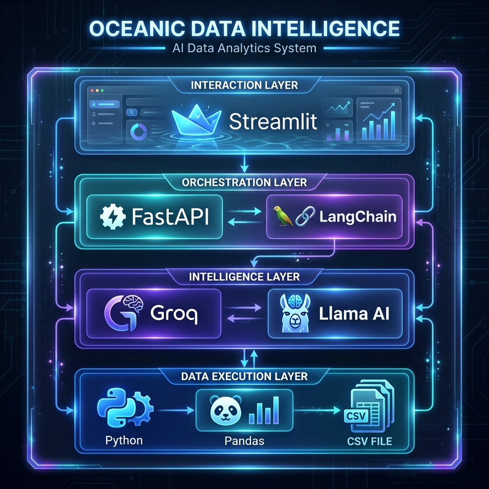
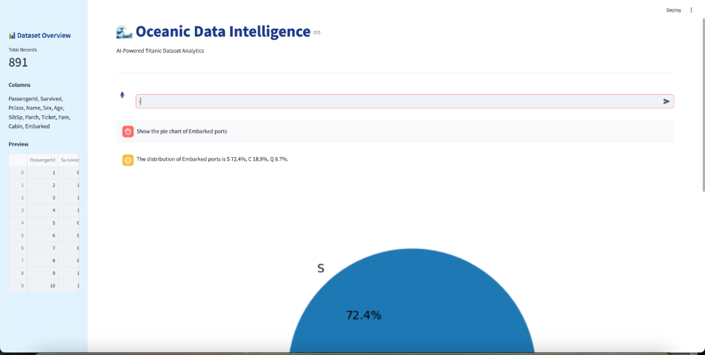

#  Oceanic Data Intelligence

Oceanic Data Intelligence is a professional-grade AI assistant designed for interactive analysis of the Titanic dataset. It combines a powerful FastAPI backend with a modern Streamlit frontend, featuring integrated hands-free voice analysis.

## Features

- ** Interactive Data Exploration**: Query the Titanic dataset using natural language to gain insights into demographics, survival rates, and more.
- ** Hands-Free Voice Analysis**: Fully integrated microphone support with advanced silence detection (3-second threshold) and automatic submission.
- ** Real-time Transcription**: Seamless conversion of speech to text for instant AI analysis.
- ** Reverse-Chronological Chat**: The most recent queries and AI insights are automatically prepended to the top of the chat history.
- ** Premium UI**: A white-themed interface with perfectly aligned input components for a professional user experience.
- ** Autonomous Backend Agent**: Powered by LangChain and Groq for fast, accurate data interpretation and retrieval.

##  Tech Stack

### Frontend
- **Streamlit**: Core application framework.
- **audio-recorder-streamlit**: For premium microphone integration.
- **SpeechRecognition**: For converting audio bytes to text.
- **Requests**: For communication with the backend API.

### Backend
- **FastAPI**: High-performance web framework for the API.
- **LangChain**: Orchestration of the AI agent and data tools.
- **Groq/OpenAI**: LLM inference for analyzing user queries.
- **Pandas**: Efficient data manipulation and analysis.

##  Getting Started

### Prerequisites
- Python 3.10+
- A [Groq API Key](https://console.groq.com/) (configured in `.env`)

### Installation

1. **Clone the repository**:
   ```bash
   git clone https://github.com/abhixw/Oceanic_Data_Intelligence.git
   cd Oceanic_Data_Intelligence
   ```

2. **Set up the backend**:
   ```bash
   cd backend
   python -m venv venv
   source venv/bin/activate  # On Windows use `venv\Scripts\activate`
   pip install -r requirements.txt
   # Create a .env file and add your GROQ_API_KEY
   ```

3. **Set up the frontend**:
   ```bash
   cd ../frontend
   # (Optional) Create a separate venv or use the root one
   pip install -r requirements.txt
   pip install audio-recorder-streamlit SpeechRecognition
   ```

### Running the Project

1. **Start the Backend**:
   ```bash
   cd backend
   uvicorn agent:app --host 127.0.0.1 --port 8000
   ```

2. **Start the Frontend**:
   ```bash
   cd frontend
   streamlit run app.py
   ```

## System Architecture



The system is built on a modular four-layer architecture for maximum scalability and precision:

1.  **Interaction Layer (Streamlit)**: A premium frontend handling voice input, transcription visualization, and real-time chat analytics.
2.  **Orchestration Layer (FastAPI & LangChain)**: The backbone that manages API requests and directs the ReAct agent loop.
3.  **Intelligence Layer (Groq & Llama 3.3 70b)**: High-speed inference engine providing advanced reasoning and data interpretation.
4.  **Data Execution Layer (Python & Pandas)**: The secure sandbox where code is executed against the Titanic dataset for 100% accurate analysis.

## Screenshots



## License
This project is licensed under the MIT License - see the LICENSE file for details.
